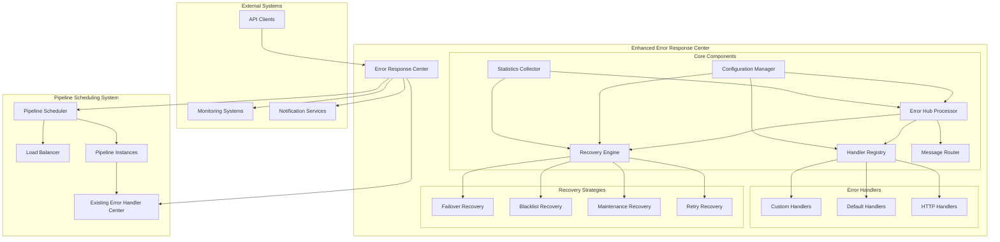
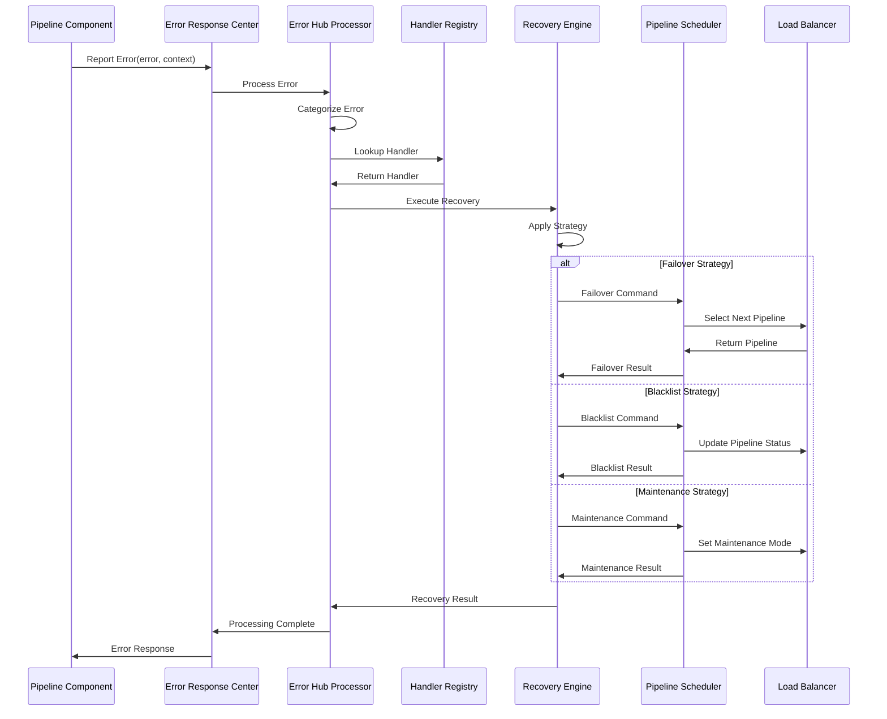
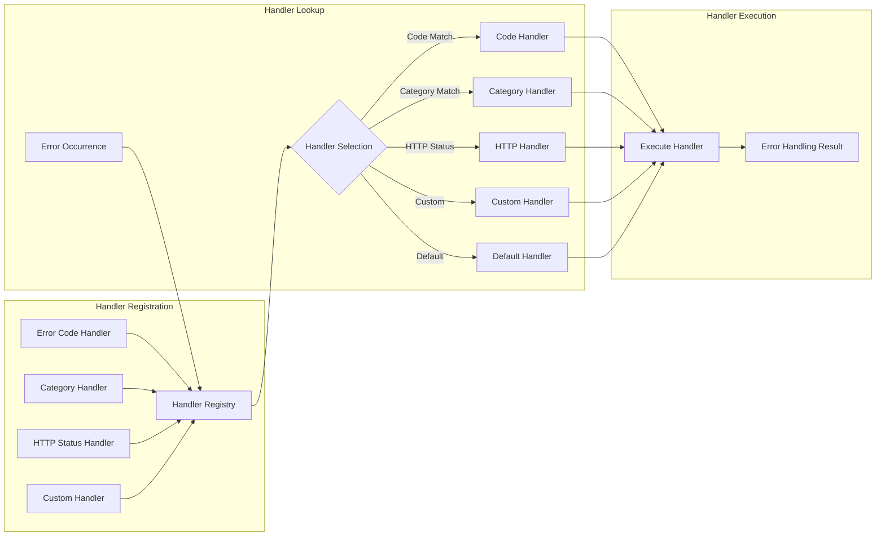
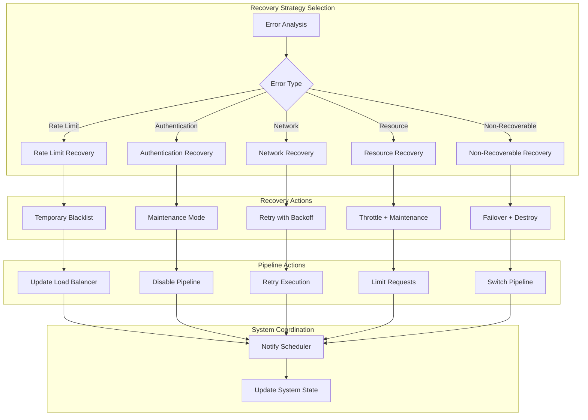
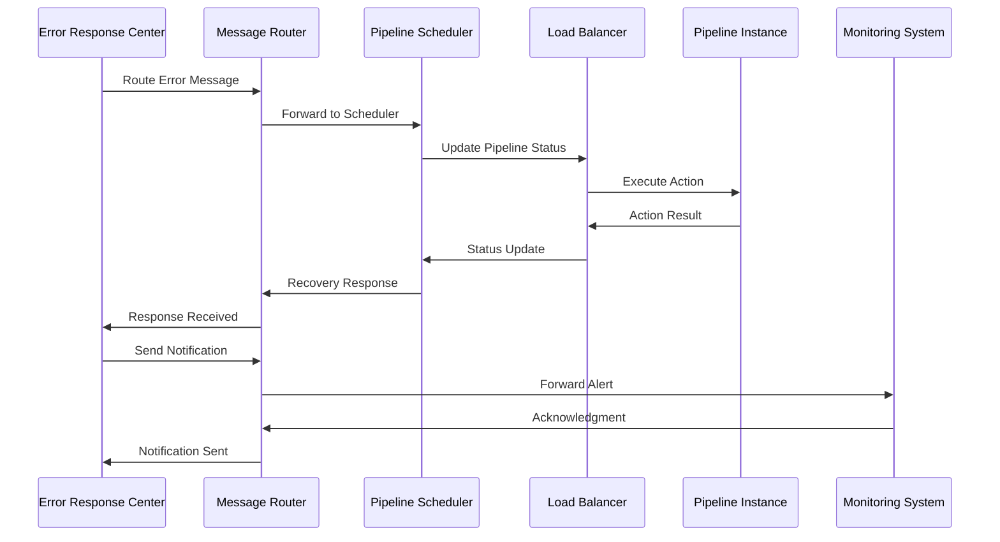
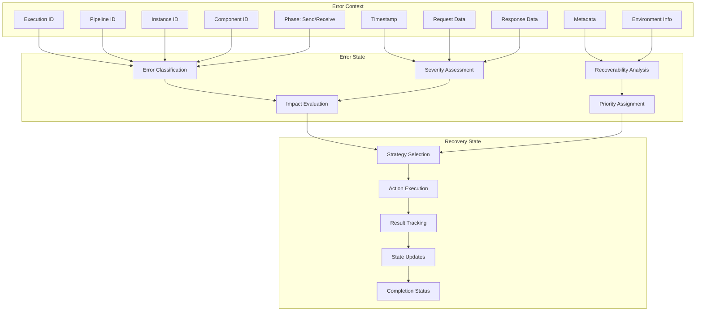
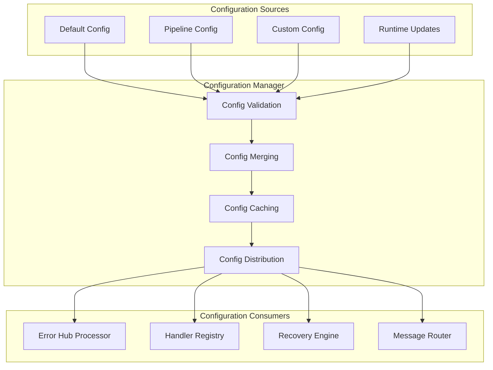
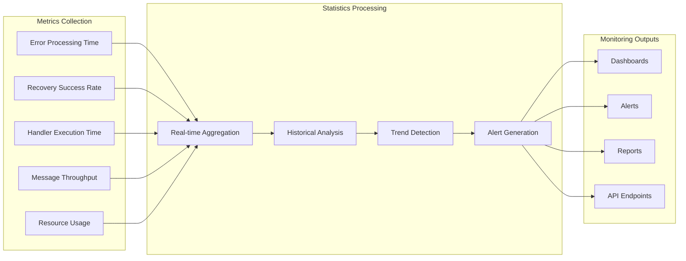
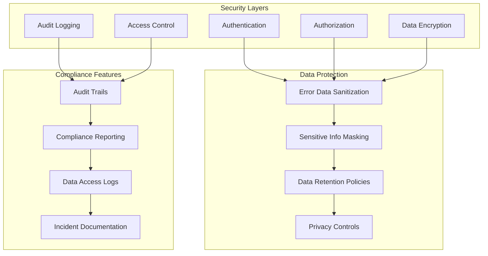
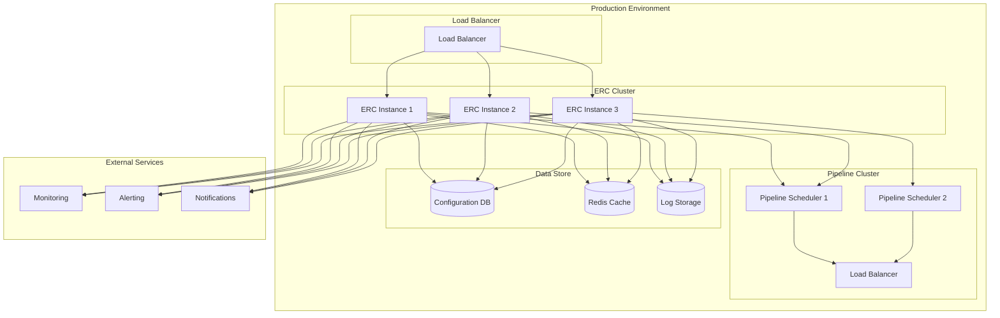

# Enhanced Error Response Center - Architecture Diagrams

## 1. System Architecture Overview

## 2. Error Processing Flow

## 3. Error Handler Registration System

## 4. Recovery Strategy Implementation

## 5. Message-Based Communication

## 6. Error Context and State Management

## 7. Configuration Management

## 8. Performance and Monitoring

## 9. Security and Compliance

## 10. Deployment Architecture

