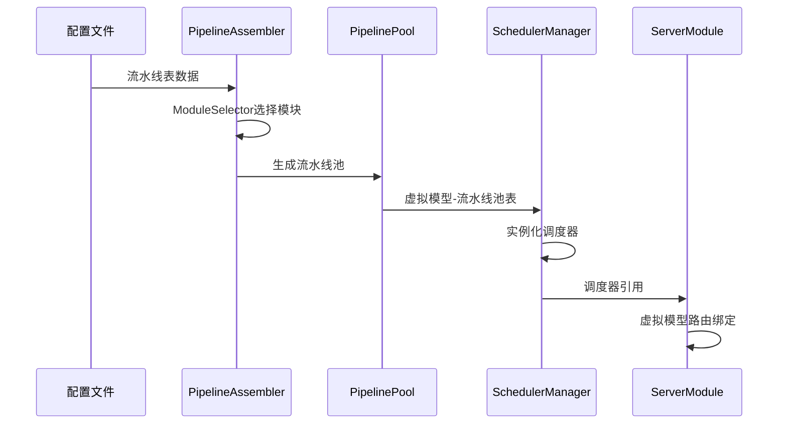

# RCC流水线和Server Module架构重构计划

## 🎯 架构理解确认

基于您的描述，我理解的新架构是：

### 正确流程：流水线→调度器→服务器
```
配置文件流水线表 → 流水线组装器按provider+model+compatibility选模块 → 组装成实例化流水线池 → 生成虚拟模型-流水线池表 → 基于该表实例化调度器 → ServerModule只做路由
```

关键原则：**ServerModule完全不参与流水线创建，只做虚拟模型路由**

---

## 🔍 当前架构问题分析

### 1. ServerModule越位承担流水线创建职责

**错误位置分析**:
- `sharedmodule/server/src/core/VirtualModelManager.ts` 第20-36行
- 尝试直接调用 `this.pipelineScheduler.registerVirtualModel()`
- ServerModule错误地试图创建和管理流水线调度器

**问题症状**:
```
"Provider 'iflow' not found, skipping target"
"Failed to create pipeline for virtual model default"
"Virtual model registered successfully (scheduler disabled or no targets)"
```

### 2. 流水线初始化流程倒置

**当前错误时序**： Server初始化 → 尝试创建流水线 → 发现provider不存在 → 失败
**正确时序**： 流水线系统初始化 → 组装流水线池 → 实例化调度器 → Server绑定已有调度器

### 3. 缺少统一的流水线组装器

**现状**：直接在ServerModule中零散处理配置转换
**需求**：独立的`PipelineAssembler`统一从配置文件生成完整流水线池

---

## 🏗️ 目标架构设计

### 三层架构定义

#### 第一层：流水线组装层 (Pipeline Assembly Layer)
**职责**: 基于配置文件流水线表，智能选择模块并组装成实例化流水线池

**核心组件**:
- `PipelineAssembler`：读取配置文件，按字段选择模块，生成流水线池
- `ModuleSelector`：根据provider+model+compatibility选择具体实现
- `PipelinePool`：管理每个虚拟模型的可用流水线池

**输入**: 配置文件中的流水线表
**输出**: 虚拟模型→流水线池的映射表

#### 第二层：调度器层 (Scheduler Layer)
**职责**: 基于流水线池表，实例化每个虚拟模型的调度器

**核心组件**:
- `VirtualModelSchedulerManager`：管理所有虚拟模型调度器
- `PipelineScheduler`：单个虚拟模型的调度器实现
- `SchedulerFactory`：根据流水线池创建调度器

**输入**: 虚拟模型→流水线池表
**输出**: 准备就绪的调度器集合

#### 第三层：服务器层 (Server Layer)
**职责**: 仅负责虚拟模型路由，将请求路由到对应调度器

**核心组件**:
- `VirtualModelRouter`：根据规则路由到虚拟模型
- `RequestDispatcher`：简单调度请求到对应调度器

**输入**: 调度器集合
**输出**: HTTP API端点

---

## 🔄 新初始化时序



---

## 🛠️ 具体重构实施计划

### 阶段T1：创建PipelineAssembler（关键基础）

**目标**：建立从配置到流水线池的核心组装能力

**任务T1.1：设计配置数据结构**
```typescript
interface PipelineCompositionTable {
  pipelines: PipelineConfig[];
  metadata: {
    version: string;
    lastUpdated: number;
  };
}

interface PipelineConfig {
  id: string;
  name: string;
  provider: string;   // "qwen" | "iflow" | ...
  model: string;      // "qwen3-coder-plus" | ...
  compatibility?: string[];  // 兼容性要求
  weight?: number;
  healthCheck?: HealthCheckConfig;
}
```

**任务T1.2：实现ModuleSelector**
```typescript
class ModuleSelector {
  selectProvider(type: string, model: string): BaseProvider;
  selectCompatibilityModule(requirements: string[]): CompatibilityModule;
  selectLLMSwitchModule(preferences: string[]): LLMSwitchModule;
}
```

**任务T1.3：构建PipelineAssembler核心**
```typescript
class PipelineAssembler {
  async assemblePipelines(configTable: PipelineCompositionTable): Promise<PipelinePool>;
  buildVirtualModelPipelinePool(virtualModelId: string, targets: TargetConfig[]): Promise<Pipeline[]>;
  validatePipelineHealth(pipeline: Pipeline): HealthStatus;
}
```

**完成标准**：
- ✅ 能从配置文件生成完整的流水线池
- ✅ 支持provider/model/compatibility智能选择
- ✅ 每个虚拟模型拥有独立的流水线池

### 阶段T2：重构调度器管理（核心能力）

**目标**：基于流水线池正确实例化调度器

**任务T2.1：重构VirtualModelSchedulerManager**
```typescript
// 新的构造函数，接受流水线池而非零散参数
constructor(pipelinePoolMap: Map<string, Pipeline[]>, tracker: PipelineTracker)

// 移除原有的pipelineFactory依赖
remove pipeline creation logic

// 添加调度器实例化方法
instantiateSchedulers(): Map<string, VirtualModelScheduler>
```

**任务T2.2：创建SchedulerFactory**
```typescript
class SchedulerFactory {
  static createScheduler(virtualModelId: string, pipelines: Pipeline[]): VirtualModelScheduler;
  configureLoadBalancing(strategy: string, pipelines: Pipeline[]): LoadBalancer;
}
```

**任务T2.3：固化调度器接口**
```typescript
interface VirtualModelScheduler {
  readonly id: string;
  readonly virtualModelId: string;
  executeRequest(request: OpenAIRequest): Promise<OpenAIResponse>;
  getHealthStatus(): HealthStatus;
  getMetrics(): SchedulerMetrics;
}
```

**完成标准**：
- ✅ 每个虚拟模型有独立调度器实例
- ✅ 调度器不再关心流水线创建细节
- ✅ 调度器只负责请求分发和负载均衡

### 阶段T3：重构ServerModule（职责净化）

**目标**：彻底移除ServerModule中的流水线创建逻辑

**任务T3.1：移除VirtualModelManager中的创建逻辑**
```typescript
// 在第20-36行移除
remove: await this.pipelineScheduler.registerVirtualModel(...)

// 改为简单的绑定
bindToScheduler(virtualModelId: string, scheduler: VirtualModelScheduler): void
```

**任务T3.2：重构ServerModule初始化**
```typescript
// 新的初始化流程
async initialize(schedulerManager: VirtualModelSchedulerManager): Promise<void> {
  // 1. 接收已准备好的调度器管理器
  this.virtualModelSchedulers = schedulerManager.getAllSchedulers();

  // 2. 建立简单的路由映射
  this.setupRoutingTable();

  // 3. 完全没有流水线创建逻辑
}
```

**任务T3.3：简化VirtualModelRouter**
```typescript
// 移除所有流水线创建相关代码
remove: Pipeline creation logic
remove: Provider discovery logic

// 只做纯路由
routeRequest(request: Request): VirtualModelScheduler {
  const virtualModelId = this.determineVirtualModel(request);
  return this.virtualModelSchedulers.get(virtualModelId);
}
```

**完成标准**：
- ✅ ServerModule只负责路由，不参与创建
- ✅ 所有流水线创建逻辑已移除
- ✅ 请求处理链路简化

### 阶段T4：系统集成与验证（最终整合）

**目标**：确保新架构协同工作

**任务T4.1：重构启动脚本**
```typescript
// 新的启动时序
const config = loadConfiguration();
const pipelinePool = await assembler.assemblePipelines(config.pipelines);
const schedulerManager = new VirtualModelSchedulerManager(pipelinePool);
await schedulerManager.initializeSchedulers();
const server = new ServerModule(schedulerManager);
await server.start();
```

**任务T4.2：建立性能基准测试**
- 虚拟模型初始化时间
- 流水线创建成功率
- 请求路由效率

**任务T4.3：验证工具调用链路**
```bash
ANTHROPIC_BASE_URL=http://localhost:5506 ANTHROPIC_API_KEY=rcc4-proxy-key claude --print "列出本目录中所有文件夹"
```

---

## ⚡ 关键代码重构示例

### 现状（错误）：
```typescript
// ServerModule - 错误地参与流水线创建
const pipeline = pipelineFactory.createPipelineFromVirtualModel({
  virtualModel: vmConfig,
  providers: new Map()  // 空的providers!
});
```

### 目标（正确）：
```typescript
// PipelineAssembler - 在独立流程中完成组装
const pipelinePool = await assembler.assemblePipelines(configTable);
// 返回：Map<string, Pipeline[]>
// key: "default", value: [Pipeline1, Pipeline2, ...]
```

---

## 🧪 测试验证策略

### 单元测试
- **PipelineAssembler**: 配置→流水线池转换正确性
- **ModuleSelector**: provider/model/compatibility选择准确性
- **VirtualModelScheduler**: 请求路由和负载均衡功能

### 集成测试
- **启动流程**：完整初始化的时序验证
- **模块发现**：确保找到所有provider和compatibility模块
- **端到端**：工具调用功能验证

### 性能测试
- **初始化时间**：流水线组装耗时应在5秒内
- **调度效率**：虚拟模型切换延迟<100ms
- **系统资源**：内存使用合理

---

## ⏲️ 任务时间表与依赖关系

```
T1: PipelineAssembler创建 (2周)
  ├── T1.1: 配置结构设计 [2天]
  ├── T1.2: ModuleSelector实现 [5天]
  └── T1.3: 流水线池组装 [7天]
       └── 依赖: T1.1, T1.2

T2: 调度器重构 (2周)
  ├── T2.1: VirtualModelSchedulerManager重构 [5天]
  ├── T2.2: SchedulerFactory创建 [5天]
  └── T2.3: 接口固化 [4天]

T3: ServerModule净化 (1.5周)
  ├── T3.1: 移除VirtualModelManager创建逻辑 [3天]
  ├── T3.2: ServerModule初始化重构 [4天]
  └── T3.3: VirtualModelRouter简化 [2天]

T4: 系统集成 (1.5周)
  ├── T4.1: 启动脚本重构 [3天]
  ├── T4.2: 性能基准建立 [4天]
  └── T4.3: 端到端验证 [2天]
```

**总预计时间**: 6-7周
**关键路径**: T1.1 → T1.2 → T1.3 → T2.1 → T2.3 → T3.1 → T4.1 → T4.3

---

## ⚠️ 风险评估与缓解措施

### 高风险项
1. **ModuleSelector复杂度**: 多层模块依赖可能导致选择逻辑复杂
   - *缓解*: 分阶段实现，先支持基础provider选择

2. **向后兼容性**: 现有配置可能与新架构不兼容
   - *缓解*: 配置版本检测和自动迁移机制

3. **性能退化**: 新的组装层可能增加启动时间
   - *缓解*: 并行组装、预编译assembly结果

### 中风险项
1. **测试覆盖不足**: 新架构需要大量新测试
2. **文档更新延迟**: 架构变化需要配套文档更新
3. **团队协作成本**: 多模块重构需要协调

---

## ✅ 最终验收标准

**功能性验收**:
- [ ] ServerModule不再包含任何流水线创建逻辑
- [ ] 所有虚拟模型都能找到对应的健康调度器
- [ ] 工具调用功能正常工作
- [ ] 配置变更能正确反映到流水线池

**性能验收**:
- [ ] 系统初始化时间 < 30秒
- [ ] 虚拟模型切换延迟 < 100ms
- [ ] 内存使用无明显增长

**架构验收**:
- [ ] 三层架构界限清晰
- [ ] 单一职责原则得到贯彻
- [ ] 新的初始化时序稳定可靠

---

## 📋 实施要点总结

1. **先隔离，再重构**：先将ServerModule的创建逻辑标记废弃
2. **从下往上建**：先实现PipelineAssembler，再重构调度器
3. **小步快跑**：每个阶段独立交付和验证
4. **测试先行**：为每个组件先写测试，再实现功能
5. **渐进切换**：支持新旧架构并行运行

这个重构计划实现了您要求的"流水线优先初始化"原则，确保架构清晰、职责单一，ServerModule完全脱离流水线创建，只专注路由转发。

**请批准此重构计划，我将严格按照这些阶段执行。**