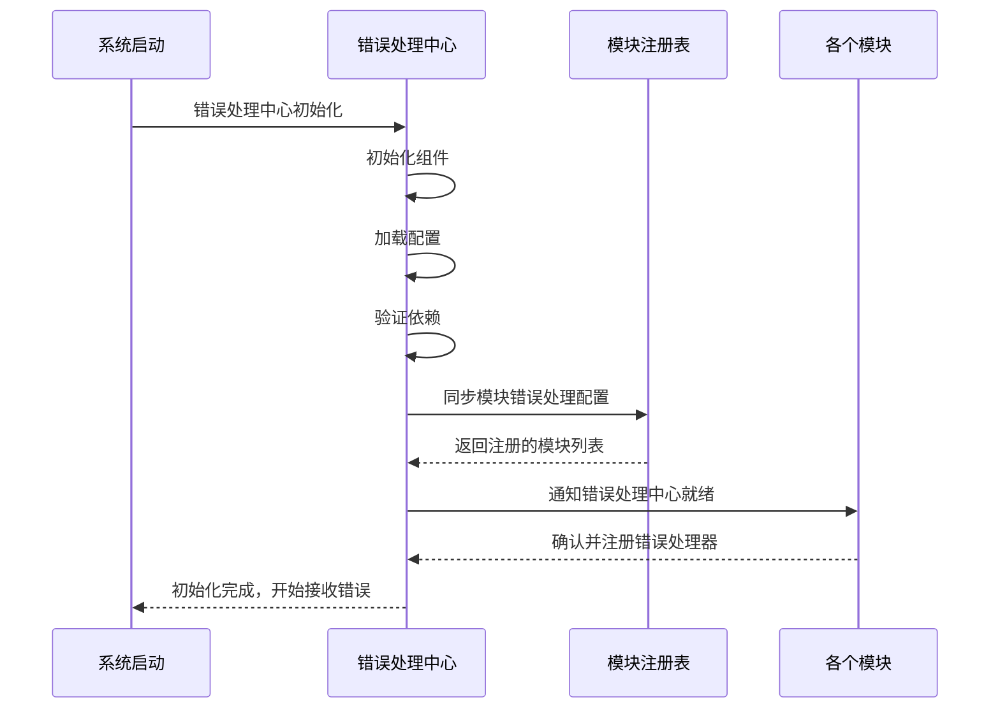
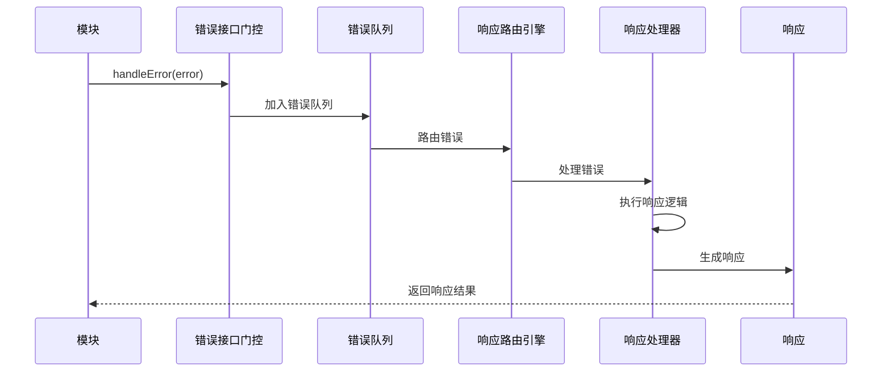
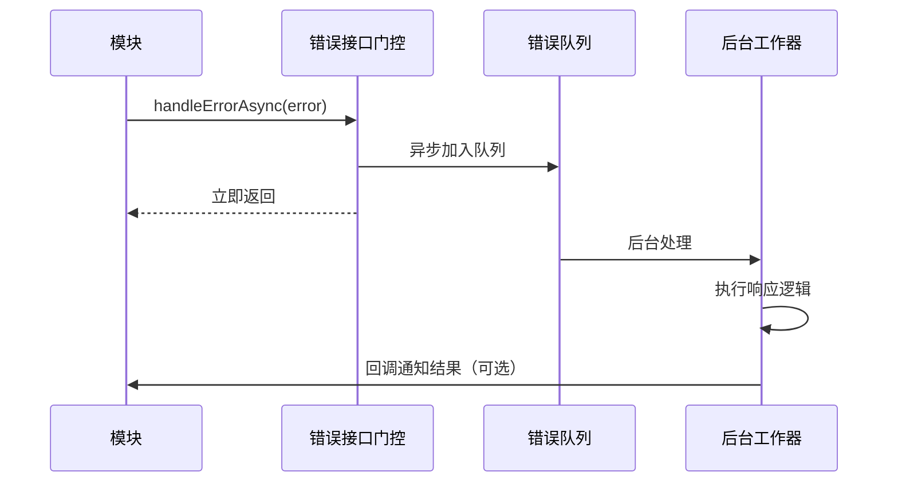

# RCC 错误处理中心设计文档

## 📋 概述

本文档描述了RCC系统错误处理中心的设计方案。错误处理中心作为系统核心组件，负责统一管理和调度所有模块的错误处理策略。

## 🎯 设计目标

1. **统一错误管理**: 所有系统错误集中处理，提供一致的错误处理接口
2. **模块化响应**: 不同模块的错误使用各自独立的响应逻辑
3. **同步/异步处理**: 支持阻塞和非阻塞的错误处理模式
4. **策略化处理**: 错误处理与错误上报分离，专注于调度和策略
5. **模块隔离**: 每个模块的错误响应逻辑独立，互相不污染

## 🏗️ 系统架构

### 核心组件

```
┌─────────────────────────────────────────────────────────────┐
│                    RCC Error Handling Center                 │
├─────────────────────────────────────────────────────────────┤
│  ┌─────────────────┐  ┌─────────────────┐  ┌─────────────────┐ │
│  │ Error Interface │  │   Error Queue   │  │ Response Router │ │
│  │   Gateway       │  │   Manager        │  │   Engine        │ │
│  └─────────────────┘  └─────────────────┘  └─────────────────┘ │
│                                                             │
│  ┌─────────────────┐  ┌─────────────────┐  ┌─────────────────┐ │
│  │ Module Registry │  │   Policy        │  │ Response        │ │
│  │   Manager       │  │   Engine        │  │   Executor      │ │
│  └─────────────────┘  └─────────────────┘  └─────────────────┘ │
│                                                             │
│  ┌─────────────────┐  ┌─────────────────┐  ┌─────────────────┐ │
│  │ Error           │  │ Response        │  │ Module          │ │
│  │   Classifier    │  │   Templates     │  │   Adapters      │ │
│  └─────────────────┘  └─────────────────┘  └─────────────────┘ │
└─────────────────────────────────────────────────────────────┘
```

### 外部接口

```
┌─────────────────┐    ┌─────────────────┐    ┌─────────────────┐
│   Modules       │    │   System        │    │   Monitoring    │
│                 │    │   Components    │    │   Tools         │
│                 │    │                 │    │                 │
│ ┌─────────────┐ │    │ ┌─────────────┐ │    │ ┌─────────────┐ │
│ │ Module A    │ │    │ │ Component X │ │    │ │ Monitor Y   │ │
│ └─────────────┘ │    │ └─────────────┘ │    │ └─────────────┘ │
│       │         │    │       │         │    │       │         │
│ ┌─────────────┐ │    │ ┌─────────────┐ │    │ ┌─────────────┐ │
│ │ Module B    │ │    │ │ Component Y │ │    │ │ Monitor Z   │ │
│ └─────────────┘ │    │ └─────────────┘ │    │ └─────────────┘ │
└──────────┬──────┘    └──────────┬──────┘    └──────────┬──────┘
           │                      │                      │
           └──────────────────────┼──────────────────────┘
                                  │
                    ┌─────────────▼─────────────┐
                    │   Error Handling Center   │
                    │                             │
                    │ ┌─────────────────────────┐ │
                    │ │    Blocking Path        │ │
                    │ │  ┌─────────────────┐    │ │
                    │ │  │ Error Interface │    │ │
                    │ │  │   Gateway - Sync │    │ │
                    │ │  └─────────────────┘    │ │
                    │ │                             │ │
                    │ │ ┌─────────────────────────┐ │ │
                    │ │ │  Non-Blocking Path    │ │ │
                    │ │ │┌─────────────────┐     │ │ │
                    │ │ ││ Error Interface │     │ │ │
                    │ │ ││  Gateway-Async │     │ │ │
                    │ │ │└─────────────────┘     │ │ │
                    │ │ └─────────────────────────┘ │ │
                    │ └─────────────────────────┘ │
                    └─────────────────────────────┘
```

## 🔧 详细设计

### 1. 错误接口门控 (Error Interface Gateway)

**职责**: 作为所有外部错误请求的统一入口点

**接口设计**:
```typescript
interface ErrorInterfaceGateway {
  // 阻塞式错误处理
  handleError(error: ErrorContext): Promise<ErrorResponse>;
  
  // 非阻塞式错误处理
  handleErrorAsync(error: ErrorContext): void;
  
  // 批量错误处理
  handleBatchErrors(errors: ErrorContext[]): Promise<ErrorResponse[]>;
  
  // 模块注册/注销
  registerModule(module: ModuleRegistration): void;
  unregisterModule(moduleId: string): void;
}
```

### 2. 错误队列管理器 (Error Queue Manager)

**职责**: 管理错误队列，处理优先级和分发

**核心功能**:
- 错误队列优先级管理（紧急/高/中/低）
- 错误去重和聚合
- 错误流控制（限流/熔断）
- 队列状态监控

### 3. 响应路由引擎 (Response Router Engine)

**职责**: 根据错误类型和模块信息路由到正确的响应处理器

**路由策略**:
```typescript
interface RoutingStrategy {
  // 按模块名路由
  routeByModuleName(moduleName: string): ResponseHandler;
  
  // 按错误类型路由
  routeByErrorType(errorType: ErrorType): ResponseHandler;
  
  // 按错误级别路由
  routeBySeverity(severity: ErrorSeverity): ResponseHandler;
  
  // 自定义路由规则
  routeByCustomRule(rule: RoutingRule): ResponseHandler;
}
```

### 4. 模块注册管理器 (Module Registry Manager)

**职责**: 管理所有注册模块的错误处理配置

**数据结构**:
```typescript
interface ModuleRegistration {
  moduleId: string;
  moduleName: string;
  version: string;
  responseHandler: ResponseHandler;
  errorPolicies: ErrorPolicy[];
  customRules: CustomRule[];
  dependencies: string[];
  metadata: ModuleMetadata;
}
```

### 5. 策略引擎 (Policy Engine)

**职责**: 执行错误处理策略，决定处理方式和响应

**策略类型**:
- **重试策略**: 自动重试、退避重试
- **降级策略**: 功能降级、服务降级
- **隔离策略**: 错误隔离、熔断隔离
- **恢复策略**: 自动恢复、手动恢复

### 6. 响应执行器 (Response Executor)

**职责**: 执行实际的错误响应逻辑

**执行模式**:
- **同步执行**: 阻塞等待处理结果
- **异步执行**: 非阻塞后台处理
- **批处理**: 批量处理多个错误

### 7. 错误分类器 (Error Classifier)

**职责**: 对错误进行分类、标记和优先级划分

**分类维度**:
```typescript
interface ErrorClassification {
  // 按来源分类
  source: ErrorSource; // MODULE, SYSTEM, EXTERNAL, NETWORK
  
  // 按类型分类
  type: ErrorType; // BUSINESS, TECHNICAL, CONFIGURATION, RESOURCE
  
  // 按严重程度分类
  severity: ErrorSeverity; // CRITICAL, HIGH, MEDIUM, LOW
  
  // 按影响范围分类
  impact: ErrorImpact; // SINGLE_MODULE, MULTIPLE_MODULE, SYSTEM_WIDE
  
  // 可恢复性分类
  recoverability: ErrorRecoverability; // RECOVERABLE, NON_RECOVERABLE, AUTO_RECOVERABLE
}
```

### 8. 响应模板管理 (Response Templates)

**职责**: 管理标准化的响应模板

**模板类型**:
- **默认响应模板** (使用UnderConstruction)
- **模块特定模板** (每个模块独立维护)
- **错误类型模板** (按错误类型定制)
- **场景模板** (特定场景定制)

### 9. 模块适配器 (Module Adapters)

**职责**: 为特定模块提供适配的响应逻辑

**适配器设计**:
```typescript
interface ModuleAdapter {
  // 模块基本信息
  getModuleInfo(): ModuleInfo;
  
  // 模块错误响应逻辑
  handleModuleError(error: ErrorContext): Promise<ErrorResponse>;
  
  // 模块注释功能
  createAnnotation(error: ErrorContext): ModuleAnnotation;
  
  // 模块依赖检查
  checkDependencies(): DependencyStatus;
}
```

## 📁 数据结构定义

### 错误上下文 (ErrorContext)
```typescript
interface ErrorContext {
  // 错误唯一标识
  errorId: string;
  
  // 错误基本信息
  error: Error;
  
  // 错误时间戳
  timestamp: Date;
  
  // 错误来源
  source: ModuleSource;
  
  // 错误分类
  classification: ErrorClassification;
  
  // 错误数据
  data: Record<string, any>;
  
  // 处理配置
  config: ErrorHandlingConfig;
  
  // 回调函数
  callback?: (response: ErrorResponse) => void;
}
```

### 错误响应 (ErrorResponse)
```typescript
interface ErrorResponse {
  // 响应ID
  responseId: string;
  
  // 错误ID
  errorId: string;
  
  // 处理结果
  result: HandlingResult;
  
  // 响应时间
  timestamp: Date;
  
  // 处理时间
  processingTime: number;
  
  // 响应数据
  data: ResponseData;
  
  // 后续操作
  actions: Action[];
  
  // 注释信息
  annotations: ModuleAnnotation[];
}
```

### 模块注释 (ModuleAnnotation)
```typescript
interface ModuleAnnotation {
  // 注释ID
  annotationId: string;
  
  // 模块信息
  moduleInfo: ModuleInfo;
  
  // 注释类型
  type: AnnotationType;
  
  // 注释内容
  content: string;
  
  // 创建时间
  createdAt: Date;
  
  // 创建者
  createdBy: string;
  
  // 关联信息
  related: RelatedInfo;
}
```

## 🔄 系统初始化流程



## 🚨 错误处理流程

### 阻塞式错误处理流程


### 非阻塞式错误处理流程


## 📋 模块响应隔离设计

### 文件结构
```
src/
├── modules/
│   ├── ErrorHandlingCenter/
│   │   ├── src/
│   │   │   ├── ErrorHandlingCenter.ts          # 主模块类
│   │   │   ├── interfaces/
│   │   │   │   ├── ErrorHandlingCenter.interface.ts
│   │   │   │   ├── ErrorContext.interface.ts
│   │   │   │   ├── ErrorResponse.interface.ts
│   │   │   │   └── ModuleResponse.interface.ts
│   │   │   ├── components/
│   │   │   │   ├── ErrorInterfaceGateway.ts
│   │   │   │   ├── ErrorQueueManager.ts
│   │   │   │   ├── ResponseRouterEngine.ts
│   │   │   │   ├── ModuleRegistryManager.ts
│   │   │   │   ├── PolicyEngine.ts
│   │   │   │   ├── ResponseExecutor.ts
│   │   │   │   ├── ErrorClassifier.ts
│   │   │   │   ├── ResponseTemplateManager.ts
│   │   │   │   └── ModuleAdapterManager.ts
│   │   │   ├── strategies/
│   │   │   │   ├── RetryStrategy.ts
│   │   │   │   ├── CircuitBreakerStrategy.ts
│   │   │   │   ├── FallbackStrategy.ts
│   │   │   │   └── RecoveryStrategy.ts
│   │   │   ├── adapters/
│   │   │   │   ├── BaseModuleAdapter.ts
│   │   │   │   ├── DefaultModuleAdapter.ts
│   │   │   │   └── ModuleAdapterFactory.ts
│   │   │   ├── templates/
│   │   │   │   ├── DefaultResponseTemplates.ts
│   │   │   │   └── DynamicTemplateLoader.ts
│   │   │   └── utils/
│   │   │       ├── ErrorIdGenerator.ts
│   │   │       ├── ErrorClassifier.ts
│   │   │       └── ErrorHandlerValidator.ts
│   │   ├── responses/                                    # 模块响应逻辑目录
│   │   │   ├── DefaultModule.response.ts                 # 默认模块响应
│   │   │   ├── BaseModule.response.ts                    # 基础模块响应
│   │   │   ├── ConfigLoaderModule.response.ts             # 配置加载模块响应
│   │   │   ├── ConfigValidatorModule.response.ts          # 配置验证模块响应
│   │   │   ├── ConfigPersistenceModule.response.ts       # 配置持久化模块响应
│   │   │   ├── ConfigUIModule.response.ts                 # 配置UI模块响应
│   │   │   ├── DebugModule.response.ts                   # 调试模块响应
│   │   │   ├── StatusLineModule.response.ts              # 状态栏模块响应
│   │   │   ├── RouterModule.response.ts                  # 路由模块响应
│   │   │   └── TestModule.response.ts                     # 测试模块响应
│   │   └── constants/
│   │       └── ErrorHandlingCenter.constants.ts
│   │   └── interfaces/
│   │       └── IErrorHandlingCenter.interface.ts
│   │   └── types/
│   │       └── ErrorHandlingCenter.types.ts
│   │   └── README.md
```

### 响应文件设计原则

1. **模块独立**: 每个模块的错误响应逻辑独立文件维护
2. **配置驱动**: 响应逻辑通过配置文件动态加载
3. **默认处理**: 使用UnderConstruction作为默认处理器
4. **版本管理**: 响应逻辑支持版本控制
5. **热更新**: 支持运行时更新响应逻辑

## ⚡ UnderConstruction集成

### 功能增强需求

基于当前UnderConstruction类的分析，需要增强以下功能：

1. **模块信息增强**:
   ```typescript
   interface EnhancedModuleInfo {
     // 基础信息
     basicInfo: ModuleInfo;
     
     // 错误处理配置
     errorHandlingConfig: ErrorHandlingConfig;
     
     // 响应逻辑配置
     responseConfig: ResponseConfig;
     
     // 注释配置
     annotationConfig: AnnotationConfig;
     
     // 依赖关系
     dependencies: ModuleDependency[];
     
     // 元数据
     metadata: ModuleMetadata;
   }
   ```

2. **注释功能集成**:
   ```typescript
   interface AnnotationGenerator {
     createErrorAnnotation(error: ErrorContext): ModuleAnnotation;
     createModuleAnnotation(moduleInfo: ModuleInfo): ModuleAnnotation;
     createDependencyAnnotation(moduleId: string): ModuleAnnotation;
   }
   ```

3. **默认响应逻辑**:
   ```typescript
   interface DefaultResponseHandler {
     handleWithUnderConstruction(error: ErrorContext): Promise<ErrorResponse>;
     generateModuleComment(moduleInfo: ModuleInfo): string;
     trackModuleStatus(moduleId: string, status: ModuleStatus): void;
   }
   ```

## 🎯 实施计划

### 阶段1: 基础架构搭建
1. 创建错误处理中心主模块
2. 实现核心接口和数据结构
3. 建立初始化和配置管理

### 阶段2: 核心组件实现
1. 实现错误接口门控和队列管理
2. 实现响应路由和策略引擎
3. 实现模块注册和响应执行

### 阶段3: 模块适配集成
1. 增强UnderConstruction类功能
2. 实现模块适配器和响应模板
3. 集成现有模块的错误处理

### 阶段4: 测试和优化
1. 单元测试各个组件
2. 集成测试整个错误处理流程
3. 性能优化和错误场景测试

### 阶段5: 部署和监控
1. 集成到系统初始化流程
2. 配置监控和告警
3. 文档完善和培训

## 📊 成功指标

- **错误覆盖率**: 100%的系统错误都能被错误处理中心捕获和处理
- **响应时效性**: 90%的错误能在100ms内得到响应
- **模块隔离性**: 每个模块的错误响应逻辑完全独立，无交叉污染
- **系统稳定性**: 错误处理中心本身的可用性达到99.9%
- **可维护性**: 新模块的错误处理集成时间小于30分钟

## 🔍 风险评估

### 技术风险
- **性能影响**: 错误处理中心可能成为系统瓶颈
  - 缓解措施: 实现异步处理、队列管理、性能监控

- **复杂性增加**: 系统复杂度显著增加
  - 缓解措施: 模块化设计、清晰接口、充分文档

### 运维风险
- **配置管理**: 错误处理策略配置复杂
  - 缓解措施: 配置版本控制、配置验证工具

- **监控困难**: 错误处理中心的监控和调试
  - 缓解措施: 丰富的日志、metrics指标、调试接口

请review此设计文档，如有任何建议或修改意见，我将进行调整并开始实施。