# RCC 系统启动流程图

## 1. 系统架构概览

```
┌─────────────────────────────────────────────────────────────────┐
│                    RCC 完整系统架构                              │
├─────────────────────────────────────────────────────────────────┤
│                                                                 │
│  ┌─────────────────┐    ┌─────────────────┐    ┌─────────────┐ │
│  │   RCC CLI      │    │   Web UI        │    │   API       │ │
│  │   入口点        │    │   配置界面       │    │   接口       │ │
│  └─────────────────┘    └─────────────────┘    └─────────────┘ │
│           │                       │                     │        │
│           └───────────────────────┼─────────────────────┘        │
│                                   │                              │
│  ┌─────────────────────────────────────────────────────────────┐ │
│  │                 核心启动系统                                │ │
│  │            start-rcc-system.mjs                             │ │
│  └─────────────────────────────────────────────────────────────┘ │
│                                   │                              │
│  ┌─────────────────────────────────────────────────────────────┐ │
│  │                 模块发现与加载                              │ │
│  └─────────────────────────────────────────────────────────────┘ │
│                                   │                              │
│  ┌─────────────────┐    ┌─────────────────┐    ┌─────────────┐ │
│  │ Configuration  │    │   Pipeline      │    │   Server    │ │
│  │    模块        │    │    模块         │    │   模块       │ │
│  └─────────────────┘    └─────────────────┘    └─────────────┘ │
│           │                       │                     │        │
│           └───────────────────────┼─────────────────────┘        │
│                                   │                              │
│  ┌─────────────────────────────────────────────────────────────┐ │
│  │                 虚拟模型路由系统                            │ │
│  └─────────────────────────────────────────────────────────────┘ │
│                                   │                              │
│  ┌─────────────────┐    ┌─────────────────┐    ┌─────────────┐ │
│  │   Qwen         │    │   LMStudio      │    │   iFlow     │ │
│  │  Provider       │    │   Provider      │    │  Provider   │ │
│  └─────────────────┘    └─────────────────┘    └─────────────┘ │
│                                                                 │
└─────────────────────────────────────────────────────────────────┘
```

## 2. 详细启动流程

### 2.1 初始启动阶段

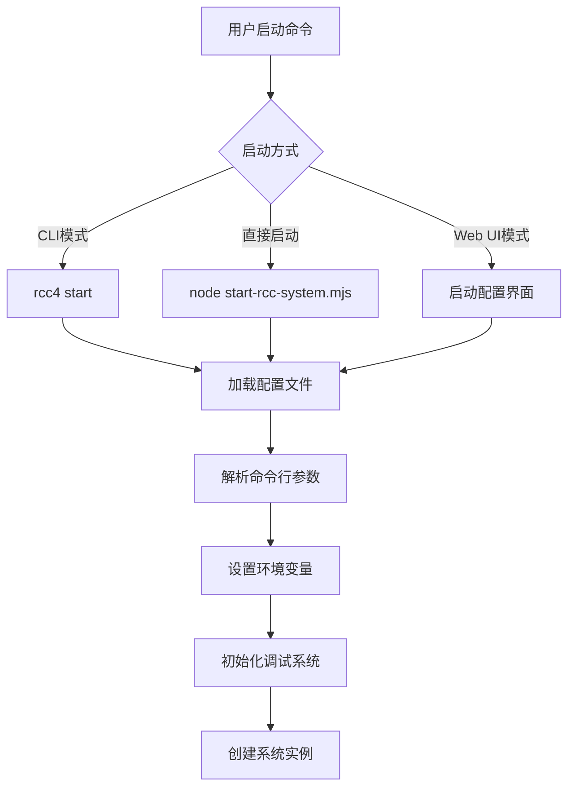

### 2.2 系统初始化流程

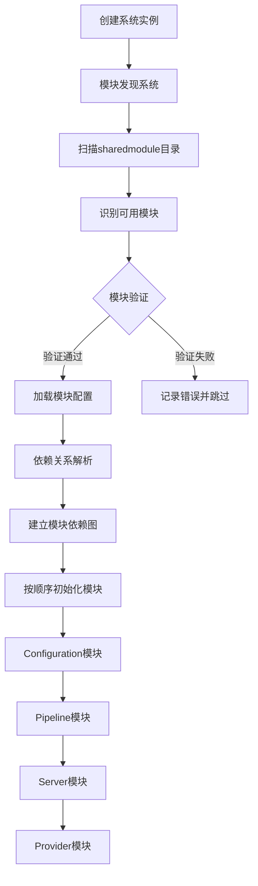

### 2.3 Configuration模块启动流程

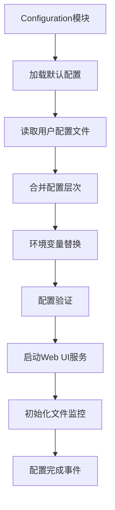

### 2.4 Pipeline模块启动流程

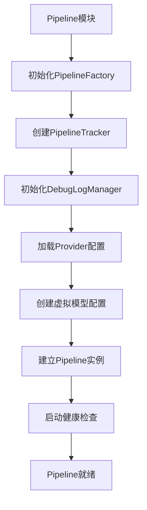

### 2.5 Server模块启动流程

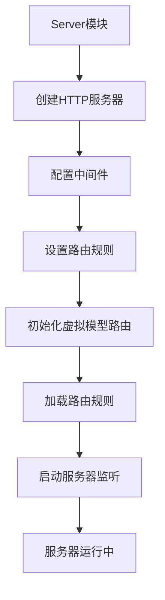

### 2.6 Provider模块启动流程

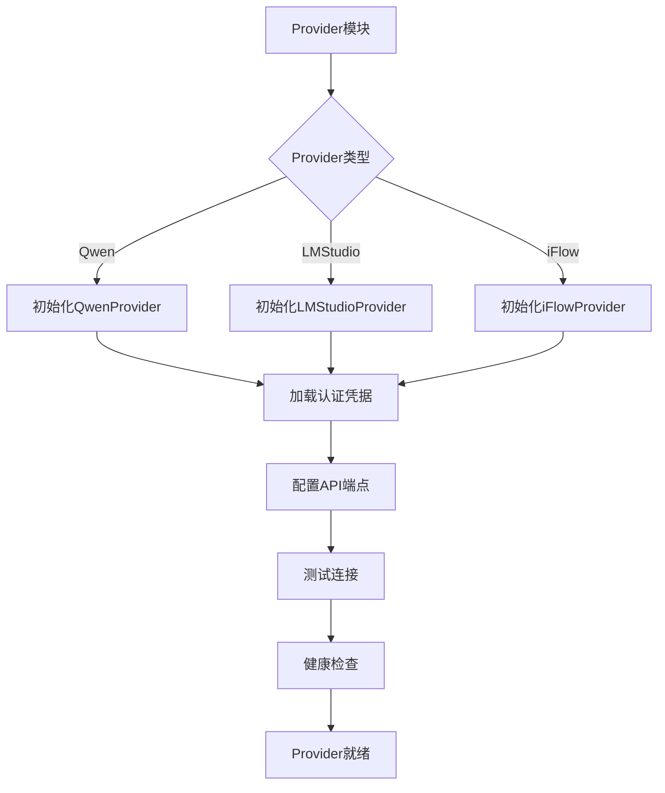

## 3. 运行时处理流程

### 3.1 请求处理流程

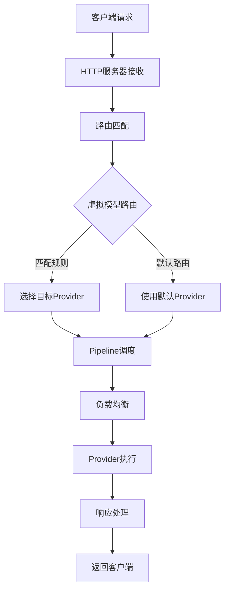

### 3.2 错误处理流程

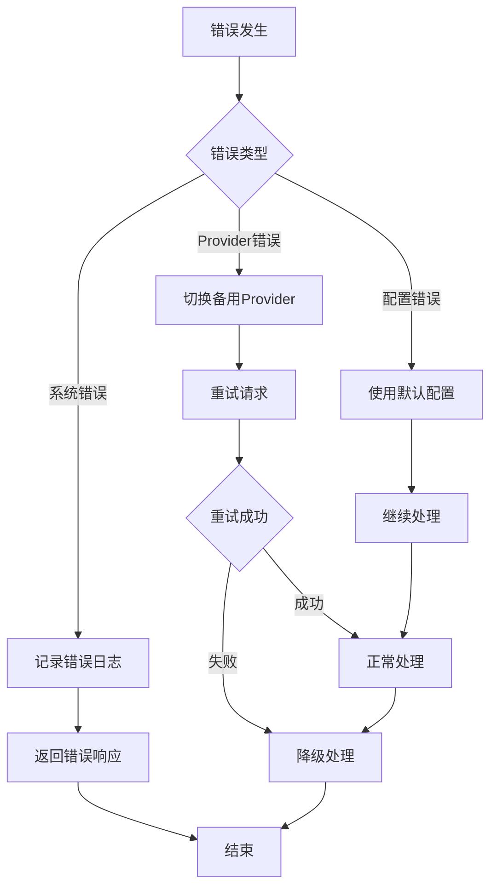

## 4. 配置和管理流程

### 4.1 动态配置更新

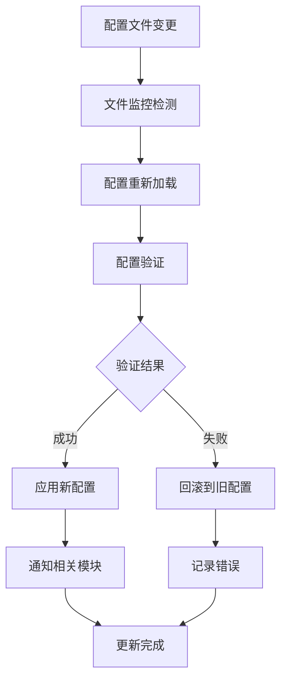

### 4.2 模块生命周期管理

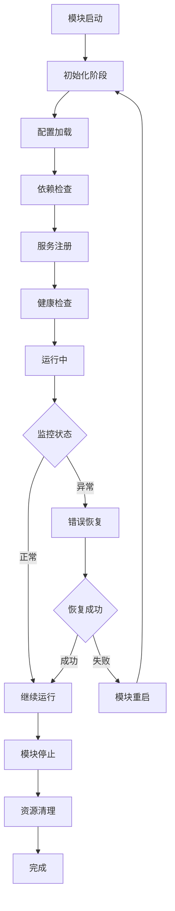

## 5. 系统监控和日志

### 5.1 调试日志系统

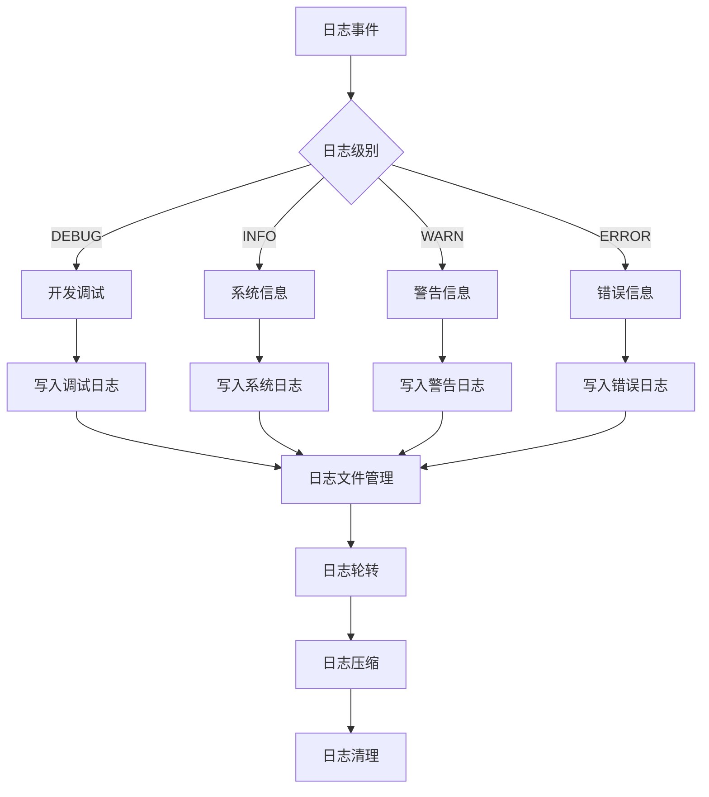

### 5.2 性能监控

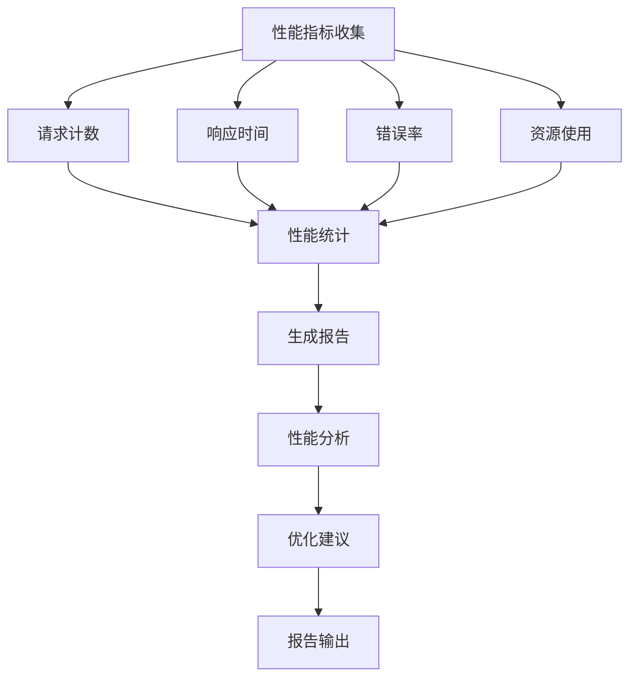

## 6. 启动命令示例

### 6.1 基本启动命令

```bash
# 1. 使用默认配置启动
./rcc4 start

# 2. 指定配置文件启动
./rcc4 start --config /path/to/config.json

# 3. 指定端口启动
./rcc4 start --port 5507

# 4. 调试模式启动
DEBUG=true ./rcc4 start

# 5. 直接使用Node.js启动
node start-rcc-system.mjs
```

### 6.2 配置示例

```json
{
  "server": {
    "port": 5507,
    "host": "localhost"
  },
  "providers": {
    "qwen": {
      "enabled": true,
      "apiKey": "your-api-key",
      "endpoint": "https://api.qwen.com"
    },
    "lmstudio": {
      "enabled": true,
      "endpoint": "http://localhost:1234"
    }
  },
  "virtualModels": [
    {
      "id": "default",
      "name": "Default Model",
      "provider": "qwen",
      "modelId": "qwen-turbo"
    }
  ]
}
```

## 7. 系统检查清单

### 7.1 启动前检查

- [ ] 确保Node.js版本 >= 14.0.0
- [ ] 检查依赖模块已安装
- [ ] 验证配置文件存在且有效
- [ ] 确保端口未被占用
- [ ] 检查网络连接

### 7.2 启动后验证

- [ ] 系统进程正常运行
- [ ] HTTP服务响应正常
- [ ] Provider连接成功
- [ ] 日志系统正常工作
- [ ] Web UI可访问

### 7.3 功能测试

- [ ] 基本请求处理
- [ ] 虚拟模型路由
- [ ] 错误处理机制
- [ ] 配置动态更新
- [ ] 性能指标收集

这个流程图涵盖了RCC系统从启动到运行的完整生命周期，包括各个模块的初始化、配置管理、请求处理和监控等方面。