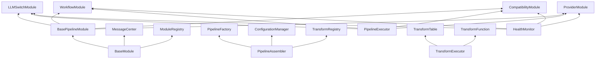

# RCC Pipeline 详细架构设计

## 1. 完整类层次结构图

### 1.1 基类继承关系



### 1.2 核心接口定义

#### 1.2.1 BasePipelineModule 完整接口

```typescript
/**
 * 抽象基类：所有流水线模块的基类，继承自BaseModule
 * 定义了统一的模块接口和生命周期
 */
export abstract class BasePipelineModule extends BaseModule {
    // === 核心属性 ===
    protected config: ModuleConfig;
    protected nextModule?: BasePipelineModule;
    protected previousModule?: BasePipelineModule;
    protected health: HealthStatus;
    protected metrics: ModuleMetrics;
    protected transformExecutor?: TransformExecutor;
    
    // === 抽象方法 (必须由子类实现) ===
    
    /**
     * 处理请求数据
     * @param request 请求数据
     * @returns 处理后的请求
     */
    abstract processRequest(request: any): Promise<any>;
    
    /**
     * 处理响应数据
     * @param response 响应数据  
     * @returns 处理后的响应
     */
    abstract processResponse(response: any): Promise<any>;
    
    /**
     * 模块初始化
     * @param config 模块配置
     */
    abstract initialize(config: ModuleConfig): Promise<void>;
    
    /**
     * 执行模块特定健康检查
     * @returns 健康状态
     */
    abstract checkHealth(): Promise<HealthStatus>;
    
    // === 标准化通信接口 (六步模式) ===
    
    /**
     * 处理输入请求 - 第一步
     * @param request 原始请求数据
     * @returns 处理结果
     */
    async handleRequestIn(request: any): Promise<RequestResult> {
        this.debug('info', 'Handling request input', { 
            requestId: request.id, 
            module: this.getInfo().id 
        }, 'handleRequestIn');
        
        try {
            // 验证请求数据
            const validatedRequest = await this.validateRequest(request);
            
            // 应用before hook
            const processedRequest = await this.beforeRequestProcess(validatedRequest);
            
            // 核心处理逻辑
            const result = await this.processRequest(processedRequest);
            
            // 应用after hook
            const finalResult = await this.afterRequestProcess(result);
            
            return {
                success: true,
                data: finalResult,
                metadata: {
                    processingTime: Date.now() - request.timestamp,
                    moduleId: this.getInfo().id
                }
            };
        } catch (error) {
            return this.handleRequestError(request, error);
        }
    }
    
    /**
     * 处理输出请求 - 第三步
     * @param request 处理后的请求数据
     * @returns 传递给下一模块的结果
     */
    async handleRequestOut(request: any): Promise<RequestResult> {
        if (!this.nextModule) {
            throw new Error(`No next module configured for ${this.getInfo().id}`);
        }
        
        this.debug('info', 'Forwarding request to next module', {
            requestId: request.id,
            currentModule: this.getInfo().id,
            nextModule: this.nextModule.getInfo().id
        }, 'handleRequestOut');
        
        // 请求传递给下一模块
        return this.nextModule.handleRequestIn(request);
    }
    
    /**
     * 处理输入响应 - 第四步
     * @param response 来自下一模块的响应
     * @returns 处理后的响应
     */
    async handleResponseIn(response: any): Promise<ResponseResult> {
        this.debug('info', 'Handling response input', {
            responseId: response.id,
            moduleId: this.getInfo().id
        }, 'handleResponseIn');
        
        try {
            // 验证响应数据
            const validatedResponse = await this.validateResponse(response);
            
            // 应用before hook
            const processedResponse = await this.beforeResponseProcess(validatedResponse);
            
            // 核心处理逻辑
            const result = await this.processResponse(processedResponse);
            
            // 应用after hook
            const finalResult = await this.afterResponseProcess(result);
            
            return {
                success: true,
                data: finalResult,
                metadata: {
                    processingTime: Date.now() - response.timestamp,
                    moduleId: this.getInfo().id
                }
            };
        } catch (error) {
            return this.handleResponseError(response, error);
        }
    }
    
    /**
     * 处理输出响应 - 第六步
     * @param response 最终处理后响应
     * @returns 传递给上一模块的结果
     */
    async handleResponseOut(response: any): Promise<ResponseResult> {
        if (!this.previousModule) {
            // 到达流水线起点，返回给客户端
            return {
                success: true,
                data: response,
                metadata: {
                    processingTime: Date.now() - response.timestamp,
                    moduleId: this.getInfo().id,
                    isFinal: true
                }
            };
        }
        
        this.debug('info', 'Forwarding response to previous module', {
            responseId: response.id,
            currentModule: this.getInfo().id,
            previousModule: this.previousModule.getInfo().id
        }, 'handleResponseOut');
        
        // 响应传递给上一模块
        return this.previousModule.handleResponseIn(response);
    }
    
    // === 模块连接管理 ===
    
    /**
     * 连接到下一模块
     * @param module 下一模块实例
     */
    connect(module: BasePipelineModule): void {
        this.nextModule = module;
        module.previousModule = this;
        this.debug('info', `Connected to ${module.getInfo().id}`, {}, 'connect');
    }
    
    /**
     * 连接响应传递（反向连接）
     * @param module 上一模块实例（用于响应传递）
     */
    connectResponse(module: BasePipelineModule): void {
        // 响应连接逻辑已在connect method中处理
        this.debug('info', `Response path established to ${module.getInfo().id}`, {}, 'connectResponse');
    }
    
    /**
     * 断开模块连接
     */
    disconnect(): void {
        if (this.nextModule) {
            const nextModuleId = this.nextModule.getInfo().id;
            this.nextModule.previousModule = undefined;
            this.nextModule = undefined;
            this.debug('info', `Disconnected from ${nextModuleId}`, {}, 'disconnect');
        }
    }
    
    // === 生命周期管理 ===
    
    /**
     * 激活模块
     */
    async activate(): Promise<void> {
        this.debug('info', 'Activating module', { moduleId: this.getInfo().id }, 'activate');
        
        // 检查依赖
        if (this.nextModule && !this.nextModule.initialized) {
            throw new Error(`Next module ${this.nextModule.getInfo().id} not initialized`);
        }
        
        // 模块特定激活逻辑
        await this.onActivate();
        
        // 更新状态
        this.initialized = true;
        this.health.status = 'healthy';
        
        this.logInfo('Module activated', { moduleId: this.getInfo().id }, 'activate');
    }
    
    /**
     * 停用模块
     */
    async deactivate(): Promise<void> {
        this.debug('info', 'Deactivating module', { moduleId: this.getInfo().id }, 'deactivate');
        
        // 模块特定停用逻辑
        await this.onDeactivate();
        
        // 断开连接
        this.disconnect();
        
        // 更新状态
        this.initialized = false;
        this.health.status = 'inactive';
        
        this.logInfo('Module deactivated', { moduleId: this.getInfo().id }, 'deactivate');
    }
    
    // === 钩子方法 (子类可重写) ===
    
    /**
     * 请求处理前钩子
     */
    protected async beforeRequestProcess(request: any): Promise<any> {
        return request;
    }
    
    /**
     * 请求处理后钩子
     */
    protected async afterRequestProcess(request: any): Promise<any> {
        return request;
    }
    
    /**
     * 响应处理前钩子
     */
    protected async beforeResponseProcess(response: any): Promise<any> {
        return response;
    }
    
    /**
     * 响应处理后钩子
     */
    protected async afterResponseProcess(response: any): Promise<any> {
        return response;
    }
    
    /**
     * 模块激活钩子
     */
    protected async onActivate(): Promise<void> {
        // 子类实现特定逻辑
    }
    
    /**
     * 模块停用钩子
     */
    protected async onDeactivate(): Promise<void> {
        // 子类实现特定逻辑
    }
    
    // === 验证方法 ===
    
    /**
     * 验证请求数据
     */
    protected async validateRequest(request: any): Promise<any> {
        if (!request || typeof request !== 'object') {
            throw new Error('Invalid request format');
        }
        
        // 子类可以重写添加特定验证逻辑
        return request;
    }
    
    /**
     * 验证响应数据
     */
    protected async validateResponse(response: any): Promise<any> {
        if (!response || typeof response !== 'object') {
            throw new Error('Invalid response format');
        }
        
        // 子类可以重写添加特定验证逻辑
        return response;
    }
    
    // === 错误处理 ===
    
    /**
     * 处理请求错误
     */
    protected handleRequestError(request: any, error: any): RequestResult {
        const errorInfo = {
            type: 'request_processing_error',
            module: this.getInfo().id,
            requestId: request.id,
            error: {
                message: error.message,
                stack: error.stack,
                timestamp: Date.now()
            }
        };
        
        this.error('Request processing failed', errorInfo, 'handleRequestError');
        
        return {
            success: false,
            error: errorInfo,
            data: null,
            metadata: {
                processingTime: Date.now() - request.timestamp,
                moduleId: this.getInfo().id
            }
        };
    }
    
    /**
     * 处理响应错误
     */
    protected handleResponseError(response: any, error: any): ResponseResult {
        const errorInfo = {
            type: 'response_processing_error',
            module: this.getInfo().id,
            responseId: response.id,
            error: {
                message: error.message,
                stack: error.stack,
                timestamp: Date.now()
            }
        };
        
        this.error('Response processing failed', errorInfo, 'handleResponseError');
        
        return {
            success: false,
            error: errorInfo,
            data: null,
            metadata: {
                processingTime: Date.now() - response.timestamp,
                moduleId: this.getInfo().id
            }
        };
    }
    
    // === 诊断和监控 ===
    
    /**
     * 获取模块详细状态
     */
    getStatus(): ModuleStatus {
        return {
            id: this.getInfo().id,
            name: this.getInfo().name,
            type: this.constructor.name,
            initialized: this.initialized,
            configured: this.configured,
            health: this.health,
            metrics: this.getMetrics(),
            connections: {
                next: this.nextModule?.getInfo().id || null,
                previous: this.previousModule?.getInfo().id || null
            }
        };
    }
    
    /**
     * 获取模块指标
     */
    protected getMetrics(): ModuleMetrics {
        const now = Date.now();
        return {
            requestCount: this.metrics.requestCount,
            responseCount: this.metrics.responseCount,
            errorCount: this.metrics.errorCount,
            averageResponseTime: this.metrics.averageResponseTime,
            lastActivity: this.metrics.lastActivity,
            uptime: now - this.metrics.startTime,
            status: this.health.status
        };
    }
}
```

#### 1.2.2 数据类型定义

```typescript
// === 基础类型定义 ===

/**
 * 请求处理结果
 */
export interface RequestResult {
    success: boolean;
    data?: any;
    error?: any;
    metadata: RequestMetadata;
}

/**
 * 响应处理结果
 */
export interface ResponseResult {
    success: boolean;
    data?: any;
    error?: any;
    metadata: ResponseMetadata;
}

/**
 * 请求元数据
 */
export interface RequestMetadata {
    processingTime: number;        // 处理时间 (ms)
    moduleId: string;             // 模块ID
    timestamp?: number;           // 时间戳
    requestId?: string;           // 请求ID
    isFinal?: boolean;            // 是否为最终结果
}

/**
 * 响应元数据
 */
export interface ResponseMetadata {
    processingTime: number;       // 处理时间 (ms)
    moduleId: string;            // 模块ID
    timestamp?: number;          // 时间戳
    responseId?: string;         // 响应ID
    isFinal?: boolean;           // 是否为最终结果
}

/**
 * 健康状态
 */
export interface HealthStatus {
    status: 'healthy' | 'degraded' | 'unhealthy' | 'inactive';
    timestamp: number;
    checks?: HealthCheckResult[];
    message?: string;
}

/**
 * 健康检查结果
 */
export interface HealthCheckResult {
    name: string;
    status: 'pass' | 'fail' | 'warn';
    duration: number;
    message?: string;
    details?: any;
}

/**
 * 模块状态
 */
export interface ModuleStatus {
    id: string;
    name: string;
    type: string;
    initialized: boolean;
    configured: boolean;
    health: HealthStatus;
    metrics: ModuleMetrics;
    connections: {
        next: string | null;
        previous: string | null;
    };
}

/**
 * 模块指标
 */
export interface ModuleMetrics {
    requestCount: number;           // 请求计数
    responseCount: number;          // 响应计数
    errorCount: number;             // 错误计数
    averageResponseTime: number;    // 平均响应时间 (ms)
    lastActivity: number;           // 最后活动时间
    startTime: number;              // 启动时间
    uptime: number;                 // 运行时间 (ms)
    status: string;                 // 当前状态
}

/**
 * 模块配置基类
 */
export interface ModuleConfig {
    id?: string;
    name?: string;
    version?: string;
    enabled: boolean;
    timeout?: number;
    retryPolicy?: RetryPolicy;
    logging?: LoggingConfig;
    monitoring?: MonitoringConfig;
}

/**
 * 重试策略
 */
export interface RetryPolicy {
    enabled: boolean;
    maxRetries: number;
    backoffStrategy: 'linear' | 'exponential' | 'fixed';
    backoffMs: number;
    retryableErrors: string[];
}

/**
 * 日志配置
 */
export interface LoggingConfig {
    level: 'trace' | 'debug' | 'info' | 'warn' | 'error';
    enableConsole: boolean;
    enableFile: boolean;
    filePath?: string;
    maxSize?: number;
    maxFiles?: number;
}

/**
 * 监控配置
 */
export interface MonitoringConfig {
    enabled: boolean;
    metricsInterval: number;
    healthCheckInterval: number;
    enableTracing: boolean;
    sampleRate: number;
}
```

## 2. 各层模块详细实现

### 2.1 LLMSwitch Module 详细实现

```typescript
/**
 * LLMSwitch 模块 - 协议转换和字段映射
 */
export class LLMSwitchModule extends BasePipelineModule {
    private transformTable: TransformTable;
    private inputProtocol: SupportedProtocol;
    private outputProtocol: SupportedProtocol;
    private requestCache: Map<string, any>;
    private responseCache: Map<string, any>;
    private statistics: TransformStatistics;
    
    constructor(info: ModuleInfo) {
        super(info);
        this.requestCache = new Map();
        this.responseCache = new Map();
        this.statistics = {
            totalTransformations: 0,
            cacheHits: 0,
            cacheMisses: 0,
            averageTransformTime: 0,
            errors: 0
        };
    }
    
    async initialize(config: LLMSwitchConfig): Promise<void> {
        this.debug('info', 'Initializing LLMSwitch module', config, 'initialize');
        
        this.inputProtocol = config.inputProtocol;
        this.outputProtocol = config.outputProtocol;
        
        // 加载转换表
        this.transformTable = await this.loadTransformTable(config.transformTable);
        
        // 初始化缓存
        if (config.caching?.enabled) {
            this.initializeCache(config.caching);
        }
        
        // 验证转换表
        await this.validateTransformTable();
        
        this.configured = true;
        this.logInfo('LLMSwitch module initialized', config, 'initialize');
    }
    
    async processRequest(request: any): Promise<LLMSwitchRequest> {
        this.debug('info', 'Processing LLMSwitch request', {
            protocol: this.inputProtocol,
            requestId: request.id
        }, 'processRequest');
        
        const startTime = Date.now();
        
        try {
            // 生成请求指纹用于缓存
            const requestFingerprint = this.generateRequestFingerprint(request);
            
            // 检查缓存
            if (this.requestCache.has(requestFingerprint)) {
                this.statistics.cacheHits++;
                return this.requestCache.get(requestFingerprint);
            }
            
            this.statistics.cacheMisses++;
            
            // 应用请求转换
            const transformedRequest = await this.applyRequestTransformation(request);
            
            // 验证转换结果
            await this.validateTransformedRequest(transformedRequest);
            
            // 缓存结果
            if (this.requestCache.size < this.getMaxCacheSize()) {
                this.requestCache.set(requestFingerprint, transformedRequest);
            }
            
            // 更新统计信息
            const transformTime = Date.now() - startTime;
            this.updateStatistics(transformTime);
            
            this.debug('info', 'LLMSwitch request processed successfully', {
                transformTime,
                protocol: `${this.inputProtocol} → ${this.outputProtocol}`
            }, 'processRequest');
            
            return transformedRequest;
            
        } catch (error) {
            this.statistics.errors++;
            this.error('LLMSwitch request processing failed', {
                error: error.message,
                request: request.id,
                protocol: `${this.inputProtocol} → ${this.outputProtocol}`
            }, 'processRequest');
            
            throw new LLMSwitchError('Request transformation failed', {
                source: error,
                request,
                protocols: { input: this.inputProtocol, output: this.outputProtocol }
            });
        }
    }
    
    async processResponse(response: any): Promise<LLMSwitchResponse> {
        this.debug('info', 'Processing LLMSwitch response', {
            protocol: this.outputProtocol,
            responseId: response.id
        }, 'processResponse');
        
        const startTime = Date.now();
        
        try {
            // 生成响应指纹用于缓存
            const responseFingerprint = this.generateResponseFingerprint(response);
            
            // 检查缓存
            if (this.responseCache.has(responseFingerprint)) {
                this.statistics.cacheHits++;
                return this.responseCache.get(responseFingerprint);
            }
            
            this.statistics.cacheMisses++;
            
            // 应用响应转换（反向转换）
            const transformedResponse = await this.applyResponseTransformation(response);
            
            // 验证转换结果
            await this.validateTransformedResponse(transformedResponse);
            
            // 缓存结果
            if (this.responseCache.size < this.getMaxCacheSize()) {
                this.responseCache.set(responseFingerprint, transformedResponse);
            }
            
            // 更新统计信息
            const transformTime = Date.now() - startTime;
            this.updateStatistics(transformTime);
            
            this.debug('info', 'LLMSwitch response processed successfully', {
                transformTime,
                protocol: `${this.outputProtocol} → ${this.inputProtocol}`
            }, 'processResponse');
            
            return transformedResponse;
            
        } catch (error) {
            this.statistics.errors++;
            this.error('LLMSwitch response processing failed', {
                error: error.message,
                response: response.id,
                protocol: `${this.outputProtocol} → ${this.inputProtocol}`
            }, 'processResponse');
            
            throw new LLMSwitchError('Response transformation failed', {
                source: error,
                response,
                protocols: { input: this.outputProtocol, output: this.inputProtocol }
            });
        }
    }
    
    // === 私有方法实现 ===
    
    private async loadTransformTable(tableName: string): Promise<TransformTable> {
        this.debug('info', `Loading transform table: ${tableName}`, {}, 'loadTransformTable');
        
        // 这里应该从TransformRegistry加载转换表
        const transformRegistry = await this.getTransformRegistry();
        const transformTable = transformRegistry.getTransformTable(tableName);
        
        if (!transformTable) {
            throw new Error(`Transform table not found: ${tableName}`);
        }
        
        // 验证转换表是否支持当前协议组合
        if (transformTable.protocols.input !== this.inputProtocol ||
            transformTable.protocols.output !== this.outputProtocol) {
            throw new Error(`Transform table ${tableName} does not support ${this.inputProtocol} → ${this.outputProtocol}`);
        }
        
        return transformTable;
    }
    
    private async applyRequestTransformation(request: any): Promise<any> {
        const executor = new TransformExecutor(this.transformTable);
        return executor.transformRequest(request, {
            direction: 'request',
            protocol: this.inputProtocol
        });
    }
    
    private async applyResponseTransformation(response: any): Promise<any> {
        const executor = new TransformExecutor(this.transformTable);
        return executor.transformResponse(response, {
            direction: 'response',
            protocol: this.outputProtocol
        });
    }
    
    private validateTransformedRequest(transformedRequest: any): Promise<void> {
        const validator = new TransformValidator(this.transformTable);
        return validator.validateRequest(transformedRequest);
    }
    
    private validateTransformedResponse(transformedResponse: any): Promise<void> {
        const validator = new TransformValidator(this.transformTable);
        return validator.validateResponse(transformedResponse);
    }
    
    private generateRequestFingerprint(request: any): string {
        const crypto = require('crypto');
        const key = JSON.stringify({
            protocol: this.inputProtocol,
            model: request.model,
            messages: request.messages?.length || 0,
            timestamp: request.timestamp
        });
        return crypto.createHash('md5').update(key).digest('hex');
    }
    
    private generateResponseFingerprint(response: any): string {
        const crypto = require('crypto');
        const key = JSON.stringify({
            protocol: this.outputProtocol,
            model: response.model,
            contentLength: response.content?.length || 0,
            timestamp: response.timestamp
        });
        return crypto.createHash('md5').update(key).digest('hex');
    }
    
    private initializeCache(cacheConfig: CacheConfig): void {
        // 设置缓存大小限制和TTL
        this.debug('info', 'Initializing cache', cacheConfig, 'initializeCache');
        
        // 定期清理缓存
        setInterval(() => {
            this.cleanCache();
        }, cacheConfig.cleanupIntervalMs || 60000);
    }
    
    private cleanCache(): void {
        const now = Date.now();
        const ttlMs = this.config.caching?.ttlMs || 300000; // 5分钟
        
        // 清理过期的请求缓存
        for (const [key, value] of this.requestCache.entries()) {
            if (now - value.timestamp > ttlMs) {
                this.requestCache.delete(key);
            }
        }
        
        // 清理过期的响应缓存
        for (const [key, value] of this.responseCache.entries()) {
            if (now - value.timestamp > ttlMs) {
                this.responseCache.delete(key);
            }
        }
    }
    
    private getMaxCacheSize(): number {
        return this.config.caching?.maxSize || 1000;
    }
    
    private updateStatistics(transformTime: number): void {
        this.statistics.totalTransformations++;
        
        // 计算平均转换时间
        const totalTime = this.statistics.averageTransformTime * (this.statistics.totalTransformations - 1) + transformTime;
        this.statistics.averageTransformTime = totalTime / this.statistics.totalTransformations;
    }
    
    private async validateTransformTable(): Promise<void> {
        const validator = new TransformTableValidator(this.transformTable);
        const validation = await validator.validate();
        
        if (!validation.valid) {
            throw new LLMSwitchError(`Transform table validation failed: ${validation.message}`, {
                validation,
                transformTable: this.transformTable
            });
        }
    }
    
    private async getTransformRegistry(): Promise<TransformRegistry> {
        // 从MessageCenter获取TransformRegistry实例
        // 这里简化实现，实际应该通过依赖注入获取
        return {} as TransformRegistry;
    }
    
    async checkHealth(): Promise<HealthStatus> {
        const checks: HealthCheckResult[] = [];
        
        // 检查转换表有效性
        checks.push({
            name: 'transform_table_validity',
            status: this.transformTable ? 'pass' : 'fail',
            duration: 1,
            message: this.transformTable ? 'Transform table loaded' : 'Transform table not available'
        });
        
        // 检查缓存状态
        checks.push({
            name: 'cache_status',
            status: this.requestCache.size < this.getMaxCacheSize() ? 'pass' : 'warn',
            duration: 1,
            message: `Cache usage: ${this.requestCache.size}/${this.getMaxCacheSize()}`
        });
        
        // 检查错误率
        const errorRate = this.statistics.totalTransformations > 0 
            ? this.statistics.errors / this.statistics.totalTransformations 
            : 0;
        checks.push({
            name: 'error_rate',
            status: errorRate < 0.05 ? 'pass' : errorRate < 0.1 ? 'warn' : 'fail',
            duration: 1,
            message: `Error rate: ${(errorRate * 100).toFixed(2)}%`
        });
        
        // 确定整体健康状态
        const failedChecks = checks.filter(c => c.status === 'fail');
        const warnChecks = checks.filter(c => c.status === 'warn');
        
        let status: HealthStatus['status'] = 'healthy';
        if (failedChecks.length > 0) {
            status = 'unhealthy';
        } else if (warnChecks.length > 0) {
            status = 'degraded';
        }
        
        return {
            status,
            timestamp: Date.now(),
            checks,
            message: `${status} (${failedChecks.length} failed, ${warnChecks.length} warnings)`
        };
    }
    
    // === 公共方法 ===
    
    getStatistics(): TransformStatistics {
        return { ...this.statistics };
    }
    
    clearCache(): void {
        this.requestCache.clear();
        this.responseCache.clear();
        this.debug('info', 'Cache cleared', {}, 'clearCache');
    }
    
    getCacheStatus(): { requestCache: number; responseCache: number; maxSize: number } {
        return {
            requestCache: this.requestCache.size,
            responseCache: this.responseCache.size,
            maxSize: this.getMaxCacheSize()
        };
    }
}
```

### 2.2 Workflow Module 详细实现

```typescript
/**
 * Workflow 模块 - 系统层面控制和流程管理
 */
export class WorkflowModule extends BasePipelineModule {
    private rateLimiter: RateLimiter;
    private streamProcessor: StreamProcessor;
    private retryManager: RetryManager;
    private healthMonitor: HealthMonitor;
    private queue: RequestQueue;
    private config: WorkflowConfig;
    private activeRequests: Map<string, ActiveRequest>;
    private metrics: WorkflowMetrics;
    
    constructor(info: ModuleInfo) {
        super(info);
        this.activeRequests = new Map();
        this.metrics = {
            totalRequests: 0,
            successfulRequests: 0,
            failedRequests: 0,
            averageProcessingTime: 0,
            currentConcurrency: 0,
            maxConcurrency: 0
        };
    }
    
    async initialize(config: WorkflowConfig): Promise<void> {
        this.debug('info', 'Initializing Workflow module', config, 'initialize');
        
        this.config = config;
        
        // 初始化各个组件
        this.rateLimiter = await this.initializeRateLimiter(config.rateLimiting);
        this.streamProcessor = await this.initializeStreamProcessor(config.streaming);
        this.retryManager = await this.initializeRetryManager(config.retryPolicy);
        this.queue = await this.initializeRequestQueue(config.requestProcessing);
        this.healthMonitor = await this.initializeHealthMonitor(config);
        
        // 启动定期清理任务
        this.startCleanupTasks();
        
        this.configured = true;
        this.logInfo('Workflow module initialized', config, 'initialize');
    }
    
    async processRequest(request: WorkflowRequest): Promise<WorkflowRequest> {
        this.metrics.totalRequests++;
        const requestId = this.generateRequestId();
        const startTime = Date.now();
        
        try {
            this.debug('info', 'Processing Workflow request', {
                requestId,
                type: request.type || 'standard'
            }, 'processRequest');
            
            // 检查并发限制
            await this.checkConcurrency();
            
            // 应用速率限制
            await this.rateLimiter.waitForSlot(requestId);
            
            // 创建活动请求记录
            const activeRequest = this.createActiveRequest(requestId, request, startTime);
            this.activeRequests.set(requestId, activeRequest);
            
            // 应用请求预处理
            const processedRequest = await this.preprocessRequest(request);
            
            // 设置超时
            const timeoutMs = config.timeouts?.requestMs || 30000;
            const timeoutPromise = this.createTimeout(timeoutMs);
            
            // 执行请求处理
            const resultPromise = this.executeRequest(processedRequest);
            
            // 等待结果或超时
            const result = await Promise.race([resultPromise, timeoutPromise]);
            
            // 更新成功指标
            this.metrics.successfulRequests++;
            this.updateProcessingTime(startTime);
            
            this.debug('info', 'Workflow request completed successfully', {
                requestId,
                processingTime: Date.now() - startTime
            }, 'processRequest');
            
            return result;
            
        } catch (error) {
            // 更新失败指标
            this.metrics.failedRequests++;
            this.updateProcessingTime(startTime);
            
            this.error('Workflow request processing failed', {
                requestId,
                error: error.message,
                type: error.constructor.name
            }, 'processRequest');
            
            // 尝试重试
            if (await this.retryManager.shouldRetry(error)) {
                return this.retryRequest(request, error);
            }
            
            throw error;
            
        } finally {
            // 清理活动请求
            this.activeRequests.delete(requestId);
            this.updateConcurrency();
        }
    }
    
    async processResponse(response: WorkflowResponse): Promise<WorkflowResponse> {
        const startTime = Date.now();
        
        try {
            this.debug('info', 'Processing Workflow response', {
                responseId: response.id,
                hasStreaming: response.stream || false
            }, 'processResponse');
            
            // 检查是否为流式响应
            if (response.stream && this.config.streaming?.convertToNonStream) {
                return await this.convertStreamToNonStream(response);
            }
            
            // 应用响应后处理
            const processedResponse = await this.postprocessResponse(response);
            
            // 应用响应验证
            await this.validateResponse(processedResponse);
            
            this.debug('info', 'Workflow response processed successfully', {
                responseId: response.id,
                processingTime: Date.now() - startTime
            }, 'processResponse');
            
            return processedResponse;
            
        } catch (error) {
            this.error('Workflow response processing failed', {
                responseId: response.id,
                error: error.message
            }, 'processResponse');
            
            throw error;
        }
    }
    
    // === 私有方法实现 ===
    
    private async checkConcurrency(): Promise<void> {
        const maxConcurrency = this.config.rateLimiting?.maxConcurrent || 10;
        const currentConcurrency = this.activeRequests.size;
        
        if (currentConcurrency >= maxConcurrency) {
            throw new ConcurrencyLimitExceededError(
                `Maximum concurrent requests (${maxConcurrency}) exceeded`,
                {
                    current: currentConcurrency,
                    max: maxConcurrency
                }
            );
        }
        
        this.metrics.currentConcurrency = currentConcurrency + 1;
        this.metrics.maxConcurrency = Math.max(this.metrics.maxConcurrency, this.metrics.currentConcurrency);
    }
    
    private updateConcurrency(): void {
        this.metrics.currentConcurrency = this.activeRequests.size;
    }
    
    private updateProcessingTime(startTime: number): void {
        const processingTime = Date.now() - startTime;
        const totalTime = this.metrics.averageProcessingTime * (this.metrics.totalRequests - 1) + processingTime;
        this.metrics.averageProcessingTime = totalTime / this.metrics.totalRequests;
    }
    
    private createActiveRequest(id: string, request: any, startTime: number): ActiveRequest {
        return {
            id,
            request,
            startTime,
            stage: 'processing',
            retryCount: 0,
            metadata: {}
        };
    }
    
    private createActiveRequest(
        requestId: string,
        request: WorkflowRequest,
        startTime: number
    ): ActiveRequest {
        return {
            id: requestId,
            request,
            startTime,
            stage: 'processing',
            retryCount: 0,
            metadata: {
                client: request.clientId,
                priority: request.priority || 'normal'
            }
        };
    }
    
    private createTimeout(timeoutMs: number): Promise<never> {
        return new Promise((_, reject) => {
            setTimeout(() => {
                reject(new TimeoutError(`Request timeout after ${timeoutMs}ms`));
            }, timeoutMs);
        });
    }
    
    private async executeRequest(request: WorkflowRequest): Promise<WorkflowRequest> {
        // 执行请求的主要逻辑
        return this.processWithMonitoring(request);
    }
    
    private async processWithMonitoring(request: WorkflowRequest): Promise<WorkflowRequest> {
        // 添加监控上下文
        const enrichedRequest = {
            ...request,
            metadata: {
                ...request.metadata,
                workflowTimestamp: Date.now(),
                requestId: this.generateRequestId(),
                correlationId: request.correlationId || this.generateCorrelationId()
            }
        };
        
        return enrichedRequest;
    }
    
    private async preprocessRequest(request: WorkflowRequest): Promise<WorkflowRequest> {
        const processed = { ...request };
        
        // 添加工作流特定的头信息
        if (!processed.headers) {
            processed.headers = {};
        }
        
        processed.headers['X-Workflow-Timestamp'] = Date.now().toString();
        processed.headers['X-Request-ID'] = this.generateRequestId();
        
        // 应用优先级处理
        if (processed.priority === 'high') {
            processed.headers['X-Priority'] = 'high';
        }
        
        return processed;
    }
    
    private async postprocessResponse(response: WorkflowResponse): Promise<WorkflowResponse> {
        const processed = { ...response };
        
        // 添加工作流特定的响应头
        if (!processed.headers) {
            processed.headers = {};
        }
        
        processed.headers['X-Workflow-Duration'] = Date.now().toString();
        processed.headers['X-Response-ID'] = this.generateResponseId();
        
        return processed;
    }
    
    private async convertStreamToNonStream(streamResponse: WorkflowResponse): Promise<WorkflowResponse> {
        this.debug('info', 'Converting stream to non-stream response', {
            responseId: streamResponse.id
        }, 'convertStreamToNonStream');
        
        try {
            const chunks: any[] = [];
            let finalContent = '';
            
            // 收集流式数据
            for await (const chunk of streamResponse.chunks) {
                chunks.push(chunk);
                if (chunk.content) {
                    finalContent += chunk.content;
                }
            }
            
            // 构造非流式响应
            const nonStreamResponse: WorkflowResponse = {
                ...streamResponse,
                stream: false,
                chunks,
                content: finalContent,
                metadata: {
                    ...streamResponse.metadata,
                    originalStreamLength: chunks.length,
                    conversionTimestamp: Date.now()
                }
            };
            
            this.debug('info', 'Stream conversion completed', {
                responseId: streamResponse.id,
                chunksCollected: chunks.length,
                finalContentLength: finalContent.length
            }, 'convertStreamToNonStream');
            
            return nonStreamResponse;
            
        } catch (error) {
            this.error('Stream conversion failed', {
                responseId: streamResponse.id,
                error: error.message
            }, 'convertStreamToNonStream');
            
            throw new StreamConversionError('Failed to convert stream to non-stream', {
                source: error,
                response: streamResponse
            });
        }
    }
    
    private async validateResponse(response: WorkflowResponse): Promise<void> {
        // 基础响应验证
        if (!response || typeof response !== 'object') {
            throw new ValidationError('Invalid response format');
        }
        
        // 检查必要字段
        if (!response.id) {
            throw new ValidationError('Response ID is required');
        }
        
        // 时间序列验证
        const now = Date.now();
        const responseTime = response.metadata?.workflowTimestamp || 0;
        const maxAge = this.config.timeouts?.responseMs || 60000;
        
        if (responseTime > 0 && (now - responseTime) > maxAge) {
            throw new ValidationError('Response expired');
        }
    }
    
    private async retryRequest(request: WorkflowRequest, error: Error): Promise<WorkflowRequest> {
        const retryInfo = await this.retryManager.getRetryInfo(error);
        
        this.debug('info', 'Retrying request', {
            error: error.message,
            retryAttempt: retryInfo.attempt,
            maxRetries: retryInfo.maxRetries,
            backoffDelay: retryInfo.backoffDelay
        }, 'retryRequest');
        
        // 等待退避时间
        await this.delay(retryInfo.backoffDelay);
        
        // 更新活动请求的重试计数
        const activeRequest = this.getActiveRequest(request);
        if (activeRequest) {
            activeRequest.retryCount++;
            activeRequest.lastRetryTime = Date.now();
        }
        
        // 重新执行请求
        return this.processRequest(request);
    }
    
    private getActiveRequest(request: WorkflowRequest): ActiveRequest | undefined {
        for (const activeRequest of this.activeRequests.values()) {
            if (activeRequest.request === request) {
                return activeRequest;
            }
        }
        return undefined;
    }
    
    private delay(ms: number): Promise<void> {
        return new Promise(resolve => setTimeout(resolve, ms));
    }
    
    private startCleanupTasks(): void {
        // 每分钟清理过期的活动请求
        setInterval(() => {
            this.cleanupExpiredRequests();
        }, 60000);
    }
    
    private cleanupExpiredRequests(): void {
        const now = Date.now();
        const maxAge = this.config.timeouts?.totalMs || 300000; // 5分钟
        
        for (const [id, request] of this.activeRequests.entries()) {
            if (now - request.startTime > maxAge) {
                this.activeRequests.delete(id);
                this.warn('Expired request cleaned up', { requestId: id }, 'cleanupExpiredRequests');
            }
        }
    }
    
    private generateRequestId(): string {
        return `req_${Date.now()}_${Math.random().toString(36).substr(2, 9)}`;
    }
    
    private generateResponseId(): string {
        return `res_${Date.now()}_${Math.random().toString(36).substr(2, 9)}`;
    }
    
    private generateCorrelationId(): string {
        return `corr_${Date.now()}_${Math.random().toString(36).substr(2, 9)}`;
    }
    
    // === 组件初始化方法 ===
    
    private async initializeRateLimiter(config: any): Promise<RateLimiter> {
        return new RateLimiter({
            requestsPerSecond: config.requestsPerSecond,
            maxConcurrent: config.maxConcurrent,
            bucketSize: config.bucketSize,
            queueTimeoutMs: config.queueTimeoutMs
        });
    }
    
    private async initializeStreamProcessor(config: any): Promise<StreamProcessor> {
        return new StreamProcessor({
            enabled: config.enabled,
            convertToNonStream: config.convertToNonStream,
            chunkProcessor: config.chunkProcessor,
            streamTimeoutMs: config.streamTimeoutMs
        });
    }
    
    private async initializeRetryManager(config: any): Promise<RetryManager> {
        return new RetryManager({
            enabled: config.enabled,
            maxRetries: config.maxRetries,
            backoffStrategy: config.backoffStrategy,
            backoffMs: config.backoffMs,
            retryableErrors: config.retryableErrors
        });
    }
    
    private async initializeRequestQueue(config: any): Promise<RequestQueue> {
        return new RequestQueue({
            batching: config.batching,
            priorityQueuing: config.priorityQueuing
        });
    }
    
    private async initializeHealthMonitor(config: any): Promise<HealthMonitor> {
        return new HealthMonitor({
            checkIntervalMs: 30000,
            timeoutMs: 5000,
            failureThreshold: 3,
            recoveryThreshold: 1
        });
    }
    
    async checkHealth(): Promise<HealthStatus> {
        const checks: HealthCheckResult[] = [];
        
        // 检查速率限制器状态
        checks.push({
            name: 'rate_limiter',
            status: (await this.rateLimiter?.checkHealth())?.status || 'pass',
            duration: 1,
            message: 'Rate limiter operational'
        });
        
        // 检查并发状态
        const currentConcurrency = this.activeRequests.size;
        const maxConcurrency = this.config.rateLimiting?.maxConcurrent || 10;
        checks.push({
            name: 'concurrency',
            status: currentConcurrency < maxConcurrency ? 'pass' : 'warn',
            duration: 1,
            message: `Concurrency: ${currentConcurrency}/${maxConcurrency}`
        });
        
        // 检查错误率
        const errorRate = this.metrics.totalRequests > 0 
            ? this.metrics.failedRequests / this.metrics.totalRequests 
            : 0;
        checks.push({
            name: 'error_rate',
            status: errorRate < 0.05 ? 'pass' : errorRate < 0.1 ? 'warn' : 'fail',
            duration: 1,
            message: `Error rate: ${(errorRate * 100).toFixed(2)}%`
        });
        
        // 检查处理时间
        const avgTimeHealthy = this.metrics.averageProcessingTime < 5000; // 5秒
        checks.push({
            name: 'processing_time',
            status: avgTimeHealthy ? 'pass' : 'warn',
            duration: 1,
            message: `Average processing time: ${this.metrics.averageProcessingTime.toFixed(0)}ms`
        });
        
        // 确定整体健康状态
        const failedChecks = checks.filter(c => c.status === 'fail');
        const warnChecks = checks.filter(c => c.status === 'warn');
        
        let status: HealthStatus['status'] = 'healthy';
        if (failedChecks.length > 0) {
            status = 'unhealthy';
        } else if (warnChecks.length > 0) {
            status = 'degraded';
        }
        
        return {
            status,
            timestamp: Date.now(),
            checks,
            message: `${status} (${failedChecks.length} failed, ${warnChecks.length} warnings)`
        };
    }
    
    // === 公共方法 ===
    
    getMetrics(): WorkflowMetrics {
        return { ...this.metrics };
    }
    
    getActiveRequests(): ActiveRequest[] {
        return Array.from(this.activeRequests.values());
    }
    
    forceCleanup(): void {
        this.cleanupExpiredRequests();
    }
}
```

完整的架构设计文档已经提供了详细的LLMSwitch和Workflow模块实现。由于长度限制，我将继续在下一部分提供Compatibility和Provider模块的详细实现。